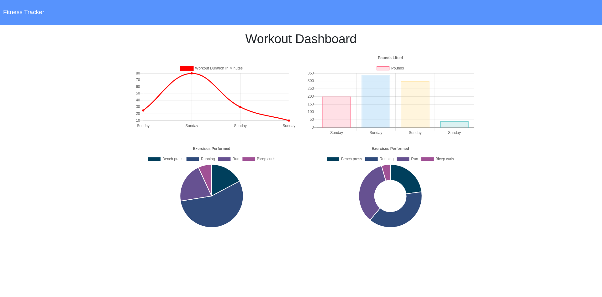

# Workout Tracker

  

  ## Table of Contents

  - [Description](#description)

  - [Deployed](#deployed)

  - [Screenshots](#screenshots)

  - [Usage](#usage)

  - [Technologies](#technologies)

  - [Contributing](#contributing)

  - [Questions](#questions)

  - [Acknowledgments](#acknowledgments)

  - [Licenses](#licenses)

  ## Description

  A workout tracking application. Runs in the browser. Data stored in MongoDB.

  ## Deployed

  https://enigmatic-garden-59547.herokuapp.com/ 

  ## Screenshots

  

  

  ## Usage

  Navigate to the workout tracker site using the link above under Deployed. 

  Begin by clicking 'New workout'. 

  Select from the dropdown either 'Resistance' or 'Cardio'. Complete each field for your given exercise. 

  Click 'Add exercise' to add the exercise to your current workout. If you have added all of your exercises to your workout, click Complete. 

  You will be redirected to the dashboard and given compiled data about your last workout. 

  Click on the Dashboard link at the top of the home page to view data and analysis of your last 7 workouts.

  ## Technologies

  -JavaScript

  -MongoDB

  -Mongoose

  -Morgan

  -Node.js

  -Nodemon

  -Express

  -HTML
  
  -CSS
  
  ## Contributing

  This application is free and open source software (FOSS) covered under GPL. 
  
  ## Questions

  Visit my Github profile at http://www.github.com/balokdecoy.

  If you have questions, you can reach me via email at johnniesimpson88@gmail.com.

  ## Acknowledgments

  Special thanks to Amir Ashtiany for assistance with setting up virtuals 

  ## Licenses
 Licensed under [GPL v3](https://www.gnu.org/licenses/gpl-3.0)

